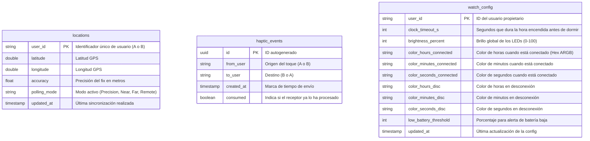
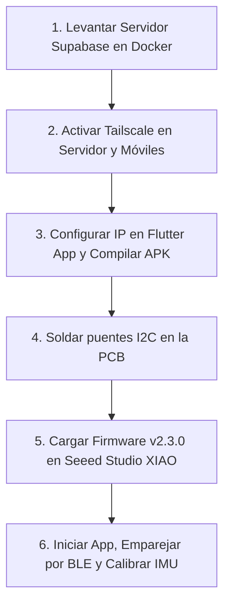

# 🎯 NEXUS HALO — Proyecto de Reloj Inteligente para Parejas (Jessi)

**Nexus Halo** es un sistema IoT integrado para parejas que consta de un **reloj inteligente vestible (wearable)**, una **aplicación móvil de acompañamiento en Flutter (Android)** y un **backend en tiempo real en Supabase (Docker + Tailscale)**.

El reloj cuenta con una corona de 12 LEDs direccionables, brújula magnética, botón táctil capacitivo (desactivado en firmware debido a ruido de hardware, reemplazado por gestos del giroscopio), motor de vibración háptica y conectividad BLE. A través de la app móvil y el GPS de fondo, los relojes muestran en tiempo real la **dirección física de la pareja (modo Radar)**, la **distancia (modo Distancia)**, la **hora sincronizada**, y permiten **enviar toques vibratorios instantáneos (háptica)**.

---

## ⚡ Tabla de Funcionalidades Principales

| Funcionalidad | Componentes Involucrados | Descripción | Configurable |
| :--- | :--- | :--- | :--- |
| **Reloj y Hora** | XIAO nRF52840, Anillo LED | Muestra la hora actual (horas, minutos y segundos) usando colores personalizables en los 12 LEDs cuando el reloj se despierta. Sincronizado por BLE. | Sí (Colores por usuario) |
| **Detección Rise-to-Wake** | Acelerómetro LSM6DS3 | Detecta el levantamiento de la muñeca para despertar el reloj automáticamente del modo de bajo consumo (`DEEP_SLEEP`). | Sí (Sensibilidad/Calibración) |
| **Doble Giro (Haptic TX)** | Giroscopio LSM6DS3, BLE, Haptic | Un doble giro rápido de muñeca (mientras el reloj está despierto) envía un toque háptico instantáneo a la pareja a través de BLE. | Sí (Ventana de doble giro: 400-1200ms) |
| **Modo Radar** | Magnetómetro LIS3MDL, GPS, Anillo LED | Un LED se enciende indicando la dirección física real (brújula) en la que se encuentra la pareja en tiempo real. | Automático (GPS < 500m) |
| **Modo Distancia** | GPS, Anillo LED | Rellena la corona de LEDs gradualmente para mostrar de manera visual la distancia a la que se encuentra la pareja. | Sí (Intervalos dinámicos) |
| **Vibración Recibida (Haptic RX)**| BLE, Motor de Vibración | Al recibir un toque de la pareja, reproduce un patrón de vibración distintivo y una animación de destellos en el anillo LED. | Sí (Quién vibra) |
| **GPS Polling Dinámico** | Foreground Service de la App, GPS | Ajusta el intervalo de consulta de GPS del móvil según la distancia (de 3s a 10 min) para ahorrar batería en el teléfono. | Sí (Límites de tiempo) |
| **Actualización OTA** | BLE, DFU Bootloader | Permite cargar nuevas versiones del firmware de forma inalámbrica a través de la app móvil. | N/A |

---

## 📁 Estructura del Proyecto

El repositorio está organizado de la siguiente manera:

*   [Docs/](file:///c:/Users/ovijo/OneDrive/Desktop/Jessi/docs): Documentación de especificación técnica completa e historial de tareas.
    *   [CHANGELOG.md](file:///c:/Users/ovijo/OneDrive/Desktop/Jessi/docs/CHANGELOG.md): Registro histórico de cambios y versiones (Actualizado a v2.1.0).
    *   [description_v_2_1.md](file:///c:/Users/ovijo/OneDrive/Desktop/Jessi/docs/description_v_2_1.md): Especificación técnica de referencia (versión 2.1.0).
    *   [tasks.md](file:///c:/Users/ovijo/OneDrive/Desktop/Jessi/docs/tasks.md): Registro de correcciones y estado de tareas.
*   [nexus_halo/](file:///c:/Users/ovijo/OneDrive/Desktop/Jessi/nexus_halo): Firmware completo en C++ para Arduino IDE compatible con **Seeed Studio XIAO nRF52840 Sense**.
*   [app/](file:///c:/Users/ovijo/OneDrive/Desktop/Jessi/app): Aplicación de acompañamiento desarrollada en **Flutter** para Android.
*   [backend/](file:///c:/Users/ovijo/OneDrive/Desktop/Jessi/backend): Infraestructura de base de datos en contenedores Docker y configuraciones de Supabase.
*   [diagnostico/](file:///c:/Users/ovijo/OneDrive/Desktop/Jessi/diagnostico): Scripts de prueba independientes para validar la brújula y el anillo LED.
    *   [compass_diagnostic/](file:///c:/Users/ovijo/OneDrive/Desktop/Jessi/diagnostico/compass_diagnostic): Testeo de bus I2C y salida del magnetómetro LIS3MDL.
    *   [led_diagnostic/](file:///c:/Users/ovijo/OneDrive/Desktop/Jessi/diagnostico/led_diagnostic): Testeo de animación y consumo eléctrico de los LEDs SK6812.
*   [hardware/](file:///c:/Users/ovijo/OneDrive/Desktop/Jessi/hardware): Recursos de diseño del dispositivo.
    *   [HW_REPAIR_TASKS.md](file:///c:/Users/ovijo/OneDrive/Desktop/Jessi/hardware/HW_REPAIR_TASKS.md): Guía física para reparar problemas del bus I2C eliminando resistencias serie.
*   [releases/](file:///c:/Users/ovijo/OneDrive/Desktop/Jessi/releases): Directorio con el ejecutable compilado listo para Android ([app-release.apk](file:///c:/Users/ovijo/OneDrive/Desktop/Jessi/releases/app-release.apk)).

---

## 🟢 1. Firmware (`nexus_halo`) v2.1.0+

El código fuente del reloj está escrito para el chip **Seeed Studio XIAO nRF52840 Sense**. El firmware implementa una máquina de estados finita (FSM) no bloqueante con 12 estados diferentes y optimizaciones avanzadas de bajo consumo.

### 🔌 Conexiones de Hardware (Esquema de Pines)

| Componente | Línea/Chip | Pin XIAO | Notas / Tipo de Señal |
| :--- | :--- | :--- | :--- |
| **Anillo LED** | 12× SK6812-MINI-E (RGB) | `D7` | Datos de un solo cable (NeoPixel). LED 0 a las 12h. |
| **Motor Vibración** | Driver MOSFET | `D9` | Salida digital (PWM para regular intensidad). |
| **Magnetómetro** | LIS3MDL (Brújula) | `D4` (SDA) / `D5` (SCL) | Bus I2C personalizado. |
| **IMU (Integrado)** | LSM6DS3TR-C | Interno (`P0.11`) | Interrupción INT1 mapeada para Wake-on-Motion. |

### ⚡ Gestión de Energía y Despertar mediante Levantar Muñeca (`Rise-to-Wake`)
En la versión v2.1.0, el reloj se despierta del modo `DEEP_SLEEP` únicamente a través de la siguiente fuente de movimiento:
1.  **Giro/Levantamiento de Muñeca (`Rise-to-Wake`):** Sensor de movimiento IMU LSM6DS3. (Este dispositivo no utiliza botón físico; todo el control se realiza mediante el giroscopio y el acelerómetro).
    *   *Trade-off de batería:* El giroscopio y el micrófono interno PDM se apagan por completo. El acelerómetro se mantiene encendido en modo de ultra bajo consumo a **26 Hz** para detectar el movimiento de giro. Esto eleva el consumo en reposo de ~8µA a ~30–35µA, reduciendo la autonomía calculada con una batería de 140mAh de **38 días a 32 días** en espera (un precio insignificante para esta funcionalidad).
    *   *Calibración Inteligente:* El reloj incluye un sistema de calibración adaptativa. Cuando entra en modo calibración mediante la app BLE, pide al usuario hacer 5 levantamientos de muñeca seguidos. Guarda el umbral ideal (con un 80% de margen de seguridad) en la memoria Flash persistente del nRF52840 para evitar falsos positivos.

### 🛡️ Salvaguarda Contra Notificaciones Accidentales (Flujo en Dos Fases)
El sistema ha sido diseñado específicamente para que no se puedan enviar notificaciones accidentales mientras el reloj está en un bolso o mochila o durante movimientos corporales bruscos:
1.  **Fase 1: Despertar (Acelerómetro).** Cuando el reloj está en reposo profundo (`DEEP_SLEEP`), el giroscopio está **totalmente apagado**. El acelerómetro de ultra bajo consumo solo vigila el levantamiento de muñeca. Un movimiento fuerte o levantamiento despierta el reloj al modo `CLOCK` para ver la hora.
2.  **Fase 2: Detección de Gestos (Giroscopio).** El giroscopio solo se enciende *después* de que el reloj ha despertado. Una vez en modo `CLOCK`, el motor de gestos analiza la velocidad angular en busca de un **Doble Giro de Muñeca** rápido (*Double Flick*) dentro de una ventana temporal ajustable (de 400 a 1200 ms). Si el movimiento que despertó al reloj no es seguido inmediatamente por este doble giro coordinado, el reloj vuelve a dormirse tras unos segundos sin enviar ningún toque.

### 🛠️ Compilación e Instalación del Firmware

1.  **Instalar placa en Arduino IDE:**
    *   Ve a `File` ➔ `Preferences`.
    *   En *Additional Boards Manager URLs* añade:
        `https://files.seeedstudio.com/arduino/package_seeeduino_boards_index.json`
    *   Ve a `Tools` ➔ `Board` ➔ `Boards Manager`, busca e instala `Seeed nRF52 Boards` (versión 2.9.1 o superior).
2.  **Instalar librerías requeridas:**
    *   `Adafruit NeoPixel`
    *   `Adafruit LIS3MDL`
    *   `Adafruit LSM6DS3TRC`
    *   `ArduinoBLE`
    *   `Adafruit Sensor`
3.  **Configuración de placa en el menú de Herramientas:**
    *   **Board:** "Seeed XIAO nRF52840 Sense"
    *   **Port:** Puerto COM asignado a tu XIAO.
4.  **Flashear:** Abre [nexus_halo.ino](file:///c:/Users/ovijo/OneDrive/Desktop/Jessi/nexus_halo/nexus_halo.ino), compila y sube el firmware.

---

## 📱 2. Companion App (`app`)

La aplicación móvil está desarrollada con **Flutter** exclusivamente para **Android**. Esta exclusividad se debe a la necesidad de utilizar un **Android Foreground Service** persistente que no sea cerrado por el sistema de ahorro de energía del sistema operativo.

### 🔋 Estrategia de Localización Dinámica (`Dynamic GPS Polling`)
Para no agotar la batería del teléfono móvil enviando coordenadas a Supabase constantemente, la aplicación monitoriza la distancia entre los usuarios en segundo plano y ajusta el intervalo de actualización GPS dinámicamente:

| Modo | Condición | Intervalo | Justificación |
| :--- | :--- | :--- | :--- |
| **PRECISION** | Distancia < 500m o Modo Radar activo | **3 segundos** | Alta precisión requerida para orientación cara a cara |
| **NEAR** | Distancia < 10 km | **60 segundos** | Cobertura normal en la misma zona de rutina diaria |
| **FAR** | Distancia 10 km – 50 km | **3 minutos** | Movimientos por el área metropolitana |
| **REMOTE** | Distancia > 50 km | **5 a 10 minutos** | Distancia muy larga (evita el consumo innecesario) |

> [!TIP]
> Si el usuario activa el modo Radar en su reloj realizando un giro simple de muñeca (cuando está despierto), el firmware notifica al teléfono mediante BLE (`RADAR_ACTIVE_CHAR`), lo que fuerza instantáneamente al Foreground Service a pasar al intervalo GPS de 3 segundos para que los datos en pantalla y el anillo LED apunten a la pareja en tiempo real y sin retraso.

### 🔑 Configuración del Entorno de Desarrollo (Flutter)
Requisitos previos: tener instalado el SDK de Flutter y las herramientas de Android.
1.  Navega al directorio `/app`.
2.  Instala las dependencias declaradas en `pubspec.yaml`:
    ```bash
    flutter pub get
    ```
3.  Establece la IP de tu servidor Supabase (obtenida mediante Tailscale) en el archivo [app/lib/main.dart](file:///c:/Users/ovijo/OneDrive/Desktop/Jessi/app/lib/main.dart):
    ```dart
    const supabaseUrl = 'http://100.x.x.x:8000'; // IP de tu nodo Tailscale
    const supabaseAnonKey = 'tu-clave-anonima-de-supabase';
    ```
4.  Compila y arranca en tu dispositivo Android conectado o emulador:
    ```bash
    flutter run
    ```

---

## 🔧 3. Servidor de Base de Datos y Comunicación (`backend`)

El backend del proyecto utiliza una pila self-hosted de **Supabase** dentro de contenedores Docker en un PC que hace de servidor doméstico. La red privada virtual de **Tailscale** sirve de puente seguro entre los teléfonos de los usuarios y el servidor local sin necesidad de abrir puertos en el router (NAT/Firewall).

### 🚀 Despliegue con Docker Compose
1.  Instala Docker Desktop (Windows/Mac) o Docker Engine (Linux) y asegúrate de que el servicio está activo.
2.  Navega a la carpeta `/backend` y levanta la pila:
    ```bash
    cd backend
    docker-compose up -d
    ```
3.  Verifica el estado de los contenedores de Supabase (`PostgreSQL`, `PostgREST`, `Realtime`, `Studio`):
    ```bash
    docker-compose ps
    ```
4.  Una vez levantados, la base de datos PostgreSQL ejecutará automáticamente el script [init-db.sql](file:///c:/Users/ovijo/OneDrive/Desktop/Jessi/backend/init-db.sql), creando las tablas requeridas y las funciones de limpieza automáticas.
5.  Puedes acceder a la interfaz de administración Supabase Studio abriendo en tu navegador local `http://localhost:3000`.

### 📊 Esquema de Datos de la Base de Datos



---

## 🛠️ 4. Diagnóstico y Corrección de Hardware

### ⚙️ Modificación de la PCB para la Brújula (LIS3MDL)
En la versión física actual de la PCB, se descubrió un problema de impedancia en las líneas de datos del bus I2C. Para corregirlo, es necesario desoldar dos resistencias en serie y puentearlas:

1.  Identifica las resistencias de **4.7kΩ** de formato **0402** en serie sobre las pistas de datos del magnetómetro:
    *   Resistencia en la línea **D4 (SDA)**.
    *   Resistencia en la línea **D5 (SCL)**.
2.  Desuelda con cuidado ambas resistencias usando soldador y pinzas.
3.  Crea un **puente de soldadura (0Ω)** conectando de forma directa ambos extremos de cada pad con una gota de estaño.
4.  Esto elimina la caída de voltaje en la línea y permite que las resistencias de elevación (*pull-ups*) internas del Seeed Studio manejen el bus de manera correcta.
5.  Puedes correr el script de prueba ubicado en [diagnostico/compass_diagnostic/compass_diagnostic.ino](file:///c:/Users/ovijo/OneDrive/Desktop/Jessi/diagnostico/compass_diagnostic/compass_diagnostic.ino) para ver si la consola del monitor serie retorna:
    `[COMPASS] ✓ LIS3MDL found on Wire (D4/D5) at 0x1E`

---

## 📊 Tabla de Referencia de Comportamientos del Reloj

### Transiciones de Estados y Gestos (Giro de Muñeca)

> [!WARNING]
> Este dispositivo NO utiliza botón táctil capacitivo físico (`TTP223`). Todo el control de la interfaz se realiza exclusivamente mediante el giroscopio para detectar giros de muñeca rápidos (*Wrist Flicks*) y el acelerómetro para el despertado automático.

#### Mapeo de Acciones y Modos

| Estado Actual | Levantar Muñeca (Acel.) | Giro Simple (1 Giro) | Giro Doble (2 Giros rápidos) | Inactividad (Timeout) |
| :--- | :--- | :--- | :--- | :--- |
| **`DEEP_SLEEP`** | Despierta ➔ `CLOCK` | — | — | *(Apagado permanente)* |
| **`CLOCK_CONNECTED`** | *(Ya despierto)* | Cambia a `RADAR_MODE` | Envía toque (háptica TX) | Se apaga ➔ `DEEP_SLEEP` (5s) |
| **`CLOCK_DISCONNECTED`** | *(Ya despierto)* | Muestra error (LED rojo) | Ignorado (sin BLE) | Se apaga ➔ `DEEP_SLEEP` (5s) |
| **`RADAR_MODE`** | *(Ya despierto)* | Regresa a Reloj | Cambia a `DISTANCE_MODE` | Regresa a Reloj (30s) |
| **`DISTANCE_MODE`** | *(Ya despierto)* | Regresa a Reloj | Cambia a `RADAR_MODE` | Regresa a Reloj (30s) |
| **`HAPTIC_RX`** | *(Ya despierto)* | Cancela vibración y vuelve | — | Regresa a Reloj (3s) |
| **`CALIBRATION_MODE`**| *(Ya despierto)* | Cancela calibración | — | Regresa a Reloj al terminar |

### Patrones de Vibración Háptica

*   **Toque Háptico Recibido (RX):**
    ```text
    [Vibrar 200ms] ➔ (Pausa 100ms) ➔ [Vibrar 200ms] ➔ (Pausa 100ms) ➔ [Vibrar 400ms]
    ```
*   **Confirmación de Envío (TX):** El motor no vibra para ahorrar batería. El anillo LED emite dos destellos rápidos de color blanco puro (`100ms ON` / `100ms OFF`).
*   **Batería Crítica (< 15%):** Emite un pulso vibratorio muy corto y suave de `100ms` cada 30 segundos junto con un parpadeo lento en rojo sobre el LED 12.
*   **Calibración completada / OTA con éxito:** Una única vibración larga y firme de `500ms`.

---

## 🚀 Guía Rápida de Puesta en Marcha

Para iniciar el entorno completo de forma rápida, sigue estos pasos estructurados:



1.  **Base de datos:** Ejecuta `docker-compose up -d` en `/backend`.
2.  **VPN Tailscale:** Asegúrate de que el servidor y los teléfonos están en la misma red Tailscale y conéctalos.
3.  **Aplicación:** Configura la IP del servidor en el código de Flutter y corre `flutter run` en el móvil Android de destino. Instala la APK.
4.  **Hardware:** Modifica los pads I2C en tu placa de circuito impreso para asegurar comunicación con la brújula LIS3MDL.
5.  **Firmware:** Sube el código del firmware [nexus_halo.ino](file:///c:/Users/ovijo/OneDrive/Desktop/Jessi/nexus_halo/nexus_halo.ino) al Seeed Studio XIAO.
6.  **Calibración final:** Abre la app en tu teléfono Android, empareja tu reloj usando la pantalla de pairing, entra en calibración en la sección de ajustes, y realiza los 5 gestos para que el reloj empiece a reaccionar a tus movimientos de muñeca de forma perfecta.
